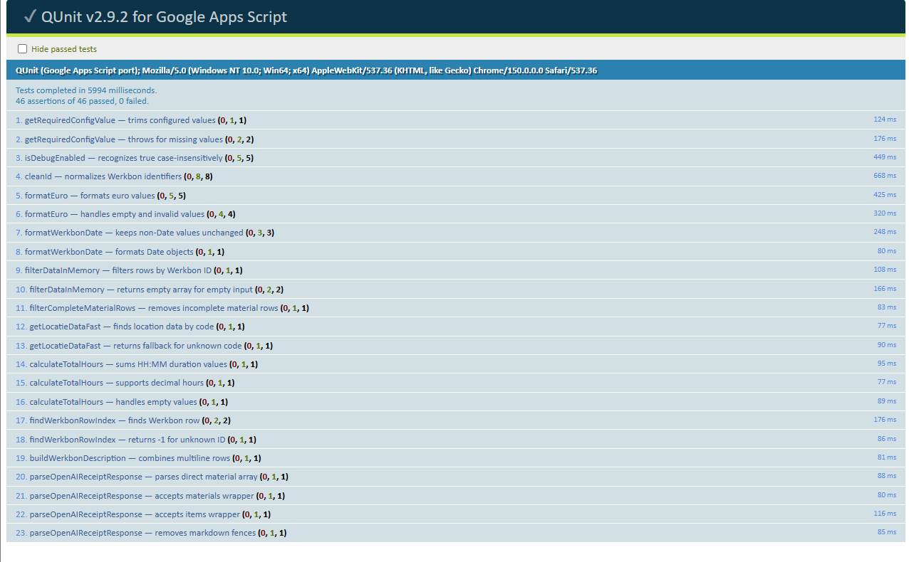
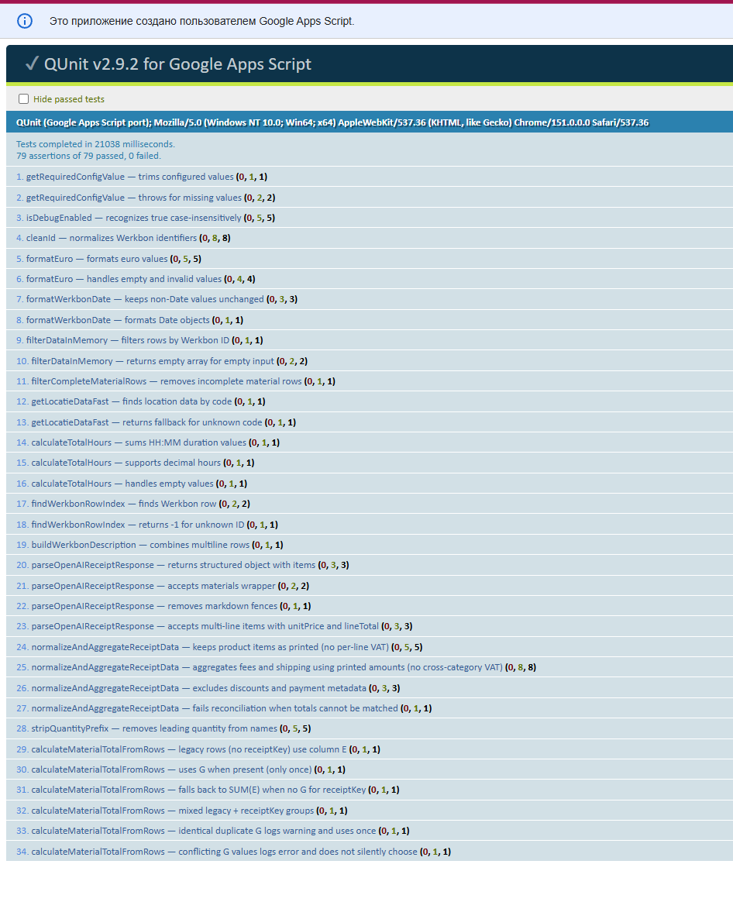
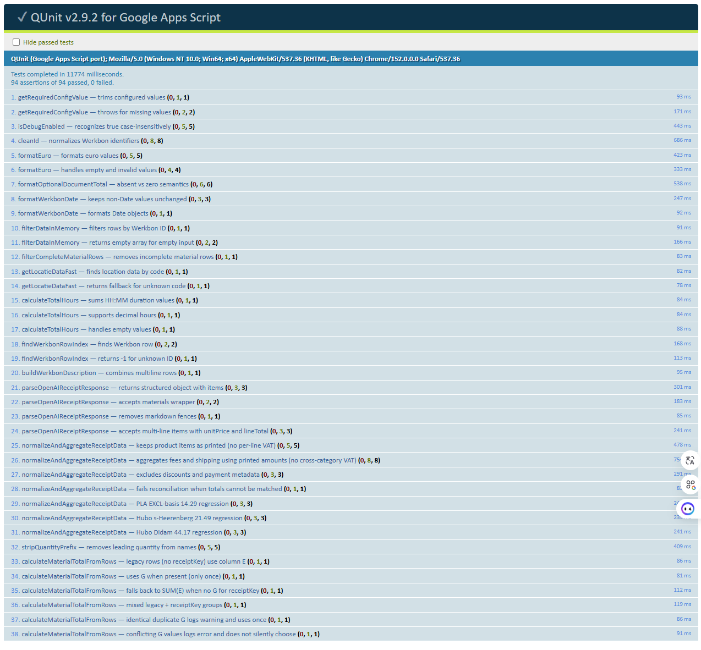

# 🚀 Generator-Werkbon-GAS

> AI-powered Google Apps Script automation for receipt recognition and PDF work order generation.


---

## 📖 Overview

Generator-Werkbon-GAS is a modular Google Apps Script project designed to automate the creation of maintenance work orders (`Werkbon`).

The current released version is **v1.10.0**, with production execution in a container-bound Spreadsheet Apps Script project.

The system uses OpenAI GPT-4o to process construction receipt images and PDF invoices, extract purchased materials, store them in Google Sheets, and generate a ready-to-print archival PDF package containing the work order and its receipt evidence.

The project was developed to reduce repetitive administrative work and demonstrate practical AI integration into everyday business workflows.

---

## 🎯 Project Goals

- Reduce manual data entry from receipts
- Minimize human errors
- Speed up work order preparation
- Automate repetitive administrative tasks
- Provide a maintainable modular codebase
- Demonstrate practical AI integration with Google Apps Script

---

## ✨ Features

- AI receipt recognition for images and PDFs using OpenAI GPT-4o
- Automatic processing of multiple receipts for a single Werkbon
- Multi-line receipt item reconstruction
- Material extraction: name, quantity, unit price and line total
- Recognition of shipping costs and additional fees
- Filtering of discounts, loyalty rewards and payment metadata
- Receipt-level document total handling (incl. VAT)
- Receipt isolation to prevent one receipt from overwriting another
- Google Sheets integration
- Google Docs template processing
- Automatic PDF generation
- Archival Werkbon PDF packaging with the Werkbon first and unique receipt evidence in persisted first-seen row order
- Existing PDF evidence passthrough and JPEG/PNG evidence conversion through Google Docs
- Final package page-count validation and exactly one final PDF persistence
- Google Drive integration
- Optimized PDF export with fallback mode
- Secure configuration using Script Properties
- Modular application architecture
- Google Sheets custom menu
- User notifications through toast messages and dialogs
- Optional debug logging for OpenAI responses

---

## 🔄 Workflow

```text
Receipt / Invoice Image or PDF
        │
        ▼
OpenAI Receipt Extraction
        │
        ▼
Structured Receipt Extraction
        │
        ▼
Validation & Normalization
        │
        ├── Materials
        ├── Shipping
        ├── Additional Fees
        └── Document Total (incl. VAT)
        │
        ▼
Google Sheets
        │
        ▼
Google Docs Template
        │
        ▼
Werkbon PDF Blob
        │
        ▼
Collect Persisted Receipt Keys
        │
        ▼
Resolve Recognized Evidence
        │
        ├── Existing PDF
        └── JPEG / PNG → One-page PDF
        │
        ▼
Ordered PDF Merge
        │
        ▼
Final Page-count Validation
        │
        ▼
Persist One Archival PDF
```

---

## 🧭 Canonical Runtime Model

The canonical production execution model for v1.10.0 is:

```text
Google Spreadsheet
        → container-bound Apps Script
        → onOpen()
        → custom menu
        → active Werkbonnen row
        → workflow
```

Production source is deployed to an Apps Script project that is bound to the target Google Spreadsheet. A generic standalone Apps Script project is not the canonical production setup, and normal production actions are launched from the Spreadsheet custom menu.

An Apps Script editor run has a different execution context: an active Spreadsheet, sheet, or range is not guaranteed. `EDITOR_TEST_WERKBON_ID` exists only for explicit editor/test execution and must remain absent from normal production configuration. Without a trusted active row or an explicit editor/test identifier, Werkbon selection fails closed instead of falling back to stale cursor state.

The full workflow pins the selected Werkbon ID for receipt processing and generation. With Status `actief`, it processes receipts and stops without creating a final PDF. With Status `klaar`, it processes receipts and proceeds to finalization only if matching `Werkbon_Uren` rows provide a positive total duration. Direct **Create PDF only** follows the same `klaar` and Uren gate. Generated Total Uren comes from `Werkbon_Uren`, not Werkbonnen column F; Materials rows are optional. Repeating finalization and multi-Werkbon allocation are not covered by this workflow.

---

## 🛠 Technologies

- Google Apps Script
- JavaScript (ES6)
- Google Sheets
- Google Docs
- Google Drive
- OpenAI API — Chat Completions for images and Responses API for PDFs (GPT-4o)
- Script Properties
- Advanced Google Drive Service

---

## 📁 Project Structure

```text
Generator-Werkbon-GAS/
│
├── 00_Config.gs
├── 01_Menu.gs
├── 02_Workflow.gs
├── 03_ReceiptProcessing.gs
├── 04_OpenAIClient.gs
├── 05_WerkbonGenerator.gs
├── 06_DocumentTables.gs
├── 07_DataHelpers.gs
├── 17_PdfBlobMerge.gs
├── 20_ImageToPdfAdapter.gs
├── 21_PdfPackageBuilder.gs
├── appsscript.json
├── README.md
├── CHANGELOG.md
├── CONTRIBUTING.md
├── SECURITY.md
└── LICENSE
```

### Module responsibilities

| Module | Responsibility |
|---|---|
| `00_Config.gs` | Script Properties, constants and configuration validation |
| `01_Menu.gs` | Custom Google Sheets menu |
| `02_Workflow.gs` | Full workflow orchestration |
| `03_ReceiptProcessing.gs` | Receipt discovery and spreadsheet updates |
| `04_OpenAIClient.gs` | OpenAI request and response parsing |
| `05_WerkbonGenerator.gs` | Work-order preparation and PDF generation |
| `06_DocumentTables.gs` | Google Docs tables and dynamic content |
| `07_DataHelpers.gs` | Data filtering, normalization and formatting |
| `17_PdfBlobMerge.gs` | Ordered PDF Blob merging and merged page-count verification |
| `20_ImageToPdfAdapter.gs` | Fail-closed JPEG/PNG evidence conversion to one-page PDF Blobs |
| `21_PdfPackageBuilder.gs` | Evidence resolution, normalization, ordering and archival package validation |

---

## ⚙️ Configuration

Store sensitive and environment-specific information using:

**Google Apps Script → Project Settings → Script Properties**

Normal production configuration contains exactly these properties:

| Property | Description |
|---|---|
| `SPREADSHEET_ID` | Parent bound Google Spreadsheet ID; it must match the Spreadsheet that owns the Apps Script project |
| `TEMPLATE_DOC_ID` | Google Docs template ID |
| `PDF_OUTPUT_FOLDER_ID` | Output folder for generated PDF files |
| `OPENAI_RECEIPTS_FOLDER_ID` | Google Drive folder containing new receipts |
| `OPENAI_API_KEY` | Secret OpenAI API key; never store it in source or the repository, and rotate it immediately if exposed |
| `STAGED_IMAGE_EXTRACTION_ENABLED` | Production feature flag; the accepted runtime value is `true`, configured through Script Properties rather than hardcoded in source |

Missing required configuration values are validated at runtime and produce a descriptive error message.

The following properties are diagnostic or test-only and are **not** part of normal production configuration:

```text
EDITOR_TEST_WERKBON_ID
DEBUG_OPENAI_RESPONSE_LOGGING
IMAGE_PDF_ADAPTER_JPEG_FILE_ID
IMAGE_PDF_ADAPTER_PNG_FILE_ID
STAGED_IMAGE_PRODUCTION_DIAGNOSTIC_FILE_ID
STAGE1_V3_DIAGNOSTIC_FILE_ID
```

---

## 🚀 Installation

1. Clone or download this repository.
2. Create or open the target Google Spreadsheet.
3. In that Spreadsheet, open **Extensions → Apps Script**.
4. Verify that the Apps Script project is container-bound to the intended Spreadsheet.
5. Verify both the Apps Script Script ID and the parent Spreadsheet identity.
6. Configure a local or staging clasp configuration for that verified Script ID. The tracked `.clasp.example.json` is only a secret-free template; a real `.clasp.json` is environment-specific and is not portable production configuration.
7. Inspect clasp's `filesToPush` before synchronization and confirm that only the intended repository source and manifest are selected.
8. Synchronize repository source only after the target identities and file list are verified.
9. Configure the approved production Script Properties listed above.
10. Reload the Spreadsheet and validate that `onOpen()` creates the expected custom menu.
11. Select the intended row on the `Werkbonnen` sheet and validate the active-row workflow from that menu.

> **Warning:** Never blindly reuse another environment's `.clasp.json`. A wrong Script ID can overwrite an unrelated Apps Script project.

---

## ⚠️ Google Sheet Copying

When copying a Google Sheet, its bound Apps Script project may also be copied automatically.

Before connecting or testing this version:

1. Open the copied Google Sheet.
2. Go to **Extensions → Apps Script**.
3. Verify which bound project belongs to the copied sheet.
4. Remove obsolete copied script code or old bound project copies from the test environment.
5. Ensure that only the intended source baseline is used. The current release is v1.10.0.
6. Reconfigure Script Properties in the copied project because they may not be transferred automatically.

> Do not delete the production Apps Script project connected to the original working spreadsheet.

This prevents duplicate menus, outdated functions, trigger conflicts and accidental execution of the previous version.

---

## 🔐 Security

This repository does not contain:

- OpenAI API keys
- Google Drive IDs
- Spreadsheet IDs
- Google Docs template IDs
- User credentials

All secrets and environment-specific resource identifiers are stored using Google Apps Script Script Properties.

If any identifier was previously committed to a public repository, access permissions should be reviewed and the affected resource should be replaced where necessary.

Raw OpenAI responses are not logged by default. `DEBUG_OPENAI_RESPONSE_LOGGING` is a diagnostic-only property, is not part of normal production configuration, and may expose sensitive receipt or invoice content. Enable it only for a bounded diagnostic and remove it afterward.

```text
DEBUG_OPENAI_RESPONSE_LOGGING=true
```

---

## 🧪 Validation

Version 1.7 was tested against a completed historical Werkbon.

The validation included:

- Existing Werkbon ID detection
- Location information
- Worked hours
- Materials and totals
- Description and completed work
- Google Docs template generation
- PDF export
- Output comparison with the previous working version

Testing on completed historical records is recommended before deploying updates to a production spreadsheet.

---

## Receipt Reliability

Version 1.7.3 extends the receipt-processing reliability layer introduced in v1.7.2.

- Multi-line product descriptions are reconstructed into a single material item.
- Multiple receipts can be processed for the same Werkbon without overwriting each other.
- Each processed receipt is isolated using a stable `receiptKey`.
- Purchased quantity is interpreted as the number of sales units, not package contents.
- Shipping costs and additional fees are recognized and included when they represent actual expenses.
- Discounts, loyalty rewards and payment metadata are excluded from Werkbon material costs.
- Supplier-printed expense values are preserved without redistributing VAT across individual rows.
- The printed document total including VAT is stored once per receipt/invoice and used for receipt-level total calculation.
- Legacy material rows without a `receiptKey` remain supported.
- Incomplete material rows are excluded from generated PDFs.

---

## Testing

**Add the QUnitGS2 library (required)**

The test suite depends on the external QUnitGS2 library.

1. Open the project in the Google Apps Script editor.
2. In the left sidebar, click **Libraries**.
3. Click **+ Add a library**.
4. Paste the Script ID:
   `1tXPhZmIyYiA_EMpTRJw0QpVGT5Pdb02PpOHCi9A9FFidblOc9CY_VLgG`
5. Select version **23**.
6. Set the identifier to `QUnitGS2`.
7. Click **Add**.

The library is declared in `appsscript.json` under `dependencies.libraries`. When using clasp, keep the manifest under version control so the dependency configuration stays synchronized with the project.

The project includes a QUnitGS2 test suite for pure and business-logic helpers.

Current test coverage includes:

- OpenAI receipt item validation
- incomplete material row filtering
- configuration validation
- Werkbon ID normalization
- currency and date formatting
- in-memory row filtering
- location lookup and fallback behavior
- working-hours calculation
- Werkbon row lookup
- multiline description aggregation
- OpenAI receipt response parsing
- multi-line receipt item reconstruction
- multiple receipts per Werkbon
- receiptKey isolation
- additional-cost classification and aggregation
- discount and payment metadata filtering
- receipt-level incl. VAT totals
- grouped material total calculation
- legacy material-row compatibility

The complete receipt-to-PDF workflow was also validated separately in an isolated Google Workspace environment using:

- a copied Google Sheet
- a copied Google Docs template
- a dedicated PDF output folder
- an existing receipt reprocessed through OpenAI Vision

The validation confirmed material extraction, Werkbon data updates, document population, and final PDF generation.

### v1.8.0 PDF-ingestion validation

PDF ingestion was validated with one controlled real Lampdirect invoice in an isolated test GAS environment. The canonical extraction and reconciliation preserved `2 × €4.60 = €9.20`, a `€0.14` fee, `€4.95` shipping, `€14.29` excl. VAT, `€3.00` VAT, and `€17.29` incl. VAT. The Materialen sheet and generated Werkbon PDF contained the correct three material rows, Column G stored `€17.29` once for the `receiptKey`, and final PDF export succeeded. This validates one controlled real-PDF fixture only; it does not establish correctness for arbitrary invoice formats or multi-PDF runs.

Multiple-file processing is supported by the common processing loop, while multi-PDF end-to-end validation remains future validation work.

### v1.9.0 archival PDF package validation

v1.9.0 introduced the archival package that places the Werkbon pages first, then includes each unique recognized evidence source according to the first occurrence of its `receiptKey` in persisted Materials rows. Existing PDFs are retained as PDFs; JPEG and PNG evidence is converted through Google Docs to a one-page PDF before the ordered merge. The completed package is persisted once only after its actual page count matches the expected total.

The accepted real workflow produced a six-page package: two Werkbon pages, followed by PDF, converted JPEG, PDF, and converted JPEG evidence in persisted first-seen order. The package contained the expected six pages, the final PDF was persisted, and temporary Google Docs resources were cleaned up.

Image conversion supports images without EXIF orientation metadata and the bounded observed identity-orientation cases. EXIF orientations 2–8 and malformed or unresolved EXIF fail closed. Small setter-induced dimension changes are diagnostic only; exact aspect-ratio equality is not guaranteed.

The staged receipt extraction path may intermittently report `structure:INVALID_SUMMARY_SOURCE_LINE`. This known issue remains outside the archival PDF packaging scope and did not block the accepted Phase D workflow.

### v1.10.0 container-bound runtime validation

Bounded runtime validation in the container-bound project confirmed `onOpen()` and custom-menu startup, active-row selection, the full workflow, new receipt extraction through OpenAI, and archival PDF packaging including temporary-document cleanup. This is evidence for the accepted runtime path only; it is not a claim of universal receipt or merchant compatibility.

---

## 📸 Screenshots

### Automated Test Results




*Historical v1.7.2 test run retained for reference.*



*Historical v1.7.3 test run retained for reference.*



v1.8.0 test suite, confirmed in the isolated test GAS environment:

- 47 tests
- 115 assertions
- 115 passed
- 0 failed

v1.9.0 archival packaging gates, confirmed in the isolated test GAS environment:

- image-pdf-adapter: 17 tests, 50 assertions, 50 passed, 0 failed
- pdf-package-builder: 17 tests, 39 assertions, 39 passed, 0 failed
- pdf-merge: 7 tests, 14 assertions, 14 passed, 0 failed
- werkbon-export-integration: 11 tests, 43 assertions, 43 passed, 0 failed

### Google Sheets


### Generated PDF

Below is an example of the generated maintenance work order.


Sample PDF:

[Werkbon_ENG-20260518-004.pdf](screenshots/template%20v.2.png)

---

## 🆕 Version 1.7.0

### Architecture

- Refactored the original monolithic `Code.gs` file into focused modules
- Centralized configuration and constants
- Separated receipt processing from OpenAI communication
- Separated document generation and table processing
- Isolated reusable data helper functions
- Improved code readability and maintainability

### Security

- Removed remaining hardcoded Google resource IDs
- Moved all environment-specific configuration to Script Properties
- Added validation for missing required properties
- Added optional OpenAI debug logging

### Reliability

- Improved user-facing error notifications
- Added optimized PDF export with a standard fallback mode
- Preserved temporary Google Docs files when PDF generation fails
- Improved compatibility with copied test spreadsheets

---

## 🗺 Future Roadmap

- [x] Modular project structure
- [x] Secure configuration validation
- [x] Automated tests for core helper and parsing functions
- [x] Multiple receipts per Werkbon
- [ ] Multi-Werkbon batch receipt processing
- [ ] Multiple document templates
- [ ] Multi-language support
- [ ] OCR fallback mode
- [x] AI response validation layer
- [ ] Structured error reporting
- [ ] REST API integration

---

## 💡 Why This Project?

This project was created to automate the preparation of maintenance work orders for municipal housing facilities in the Netherlands.

Instead of manually reviewing receipts, copying material names, calculating totals and generating PDF reports, the workflow automates the process using AI and Google Workspace.

The goal is to reduce administrative work, improve accuracy and demonstrate practical AI integration in business automation.

---

## 📜 License

This project is licensed under the MIT License.

---

## 👤 Author

**Denys Ostroushko**

GitHub:  
https://github.com/DorianGray-web

---

⭐ If you find this project useful, consider giving it a star!
